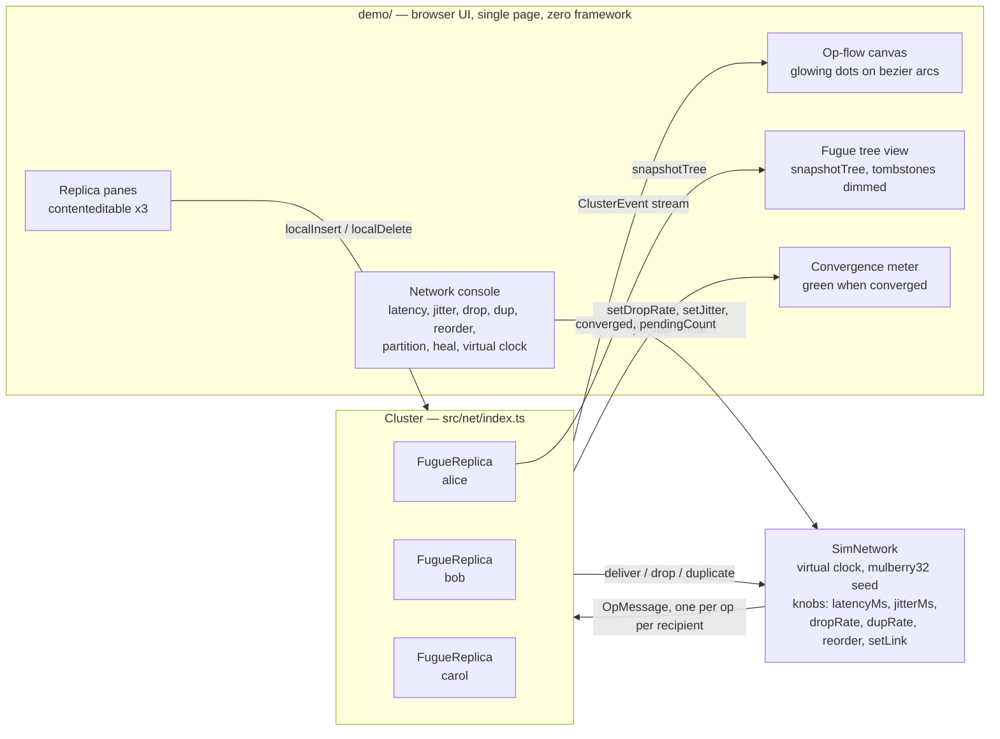

# Architecture

contrapunctus is a Fugue-tree CRDT collaborative text engine: several replicas ("voices") edit text
concurrently, their operations travel through a simulated lossy/reordering/partitioning network, and
every replica converges to the same text without character loss, duplication, or interleaving of
concurrent typing runs. The core implements the Fugue Max Tree algorithm from Weidner & Kleppmann,
*The Art of the Fugue: Minimizing Interleaving in Collaborative Text Editing* (2023), the network
layer is a deterministic chaos simulator, and the demo is a single-page, zero-framework browser UI.
Zero runtime dependencies, TypeScript ESM, strict mode. (The name is a nod to Bach's *Art of Fugue*,
whose movements are titled *Contrapunctus* — independent voices, one coherent score.)

## System diagram

Lifecycle of one edit: `localInsert` splits the text with `Intl.Segmenter` (one `Op` per grapheme
cluster) → `Cluster` broadcasts one `SimNetwork` message per (op, recipient) → the virtual clock
delivers it, possibly delayed, reordered, dropped, or duplicated → `FugueReplica.applyRemote` applies
the op immediately if its parent is known, else buffers it until causally ready → replicas converge
(they may only ever differ by ops that are still in flight or lost).

## Why Fugue

### The interleaving problem

Two users place their cursors at the same spot and type concurrently: Alice types `Alice`, Bob types
`Bob`. Every correct CRDT guarantees both words survive with their internal order intact — but the
*relative* order of per-character insertions is up to the algorithm, and classic list CRDTs can
shuffle the two runs character by character:

- Good outcomes: `AliceBob` or `BobAlice` — each run stays contiguous and readable.
- Bad outcome: a per-character scramble such as `ABloibce` — every letter survived, but the text is
  corrupted for reading, search, spell-check, and any downstream diff.

This is not a corner case. Concurrent typing at nearby positions is the *normal* case in a co-editing
session, and the flaw affects both CRDTs and Operational Transformation (Weidner & Kleppmann 2023,
abstract).

### Where RGA and Yjs still fall short

RGA and Yjs (YATA) keep a single concurrent run contiguous in the simple same-anchor case — when two
runs start at exactly the same position, only the two run *heads* are concurrent siblings, and the
rest of each run is causally chained behind its head. The hard cases are *staggered* anchors, where
concurrent insertions attach at different, adjacent positions of each other's growing runs. The paper
exhibits concrete executions in which RGA's and Yjs's sibling tie-breaking rules interleave text in
exactly these cases, and shows no simple timestamp/ID ordering fixes all of them.

### What Fugue Max Tree guarantees

The paper defines **maximal non-interleaving** (Definition 4): the strong list specification of
Attiya et al. plus (1) *forward* non-interleaving, (2) *backward* non-interleaving with a precisely
characterized exception, and (3) a deterministic ID ordering for elements sharing both origins. It
proves that **FugueMax** satisfies this property — it interleaves only where interleaving is
provably unavoidable — while the simpler **Fugue** variant satisfies forward non-interleaving and
may interleave slightly more in rare multi-concurrent executions (FugueMax backward-interleaves one
fewer pair of characters). The authors nonetheless recommend the simpler variant in practice.

In the paper's terms: Fugue maintains a tree of insertions (each node's parent is its insertion's
left origin) and reads the document out by a depth-first pre-order traversal; FugueMax additionally
visits right-side siblings in reverse order of their right origins, breaking ties by ID.

**What contrapunctus implements** (per `DESIGN.md`): the Max Tree variant exposed as a
`(parent, side)` tree. Every character is a node with an `ItemId`; an insert op records its parent
node and an attachment side (`"L"` or `"R"`) under that parent; visible text is the in-order
traversal of the tree. Concurrent inserts landing at the same parent and side are totally ordered
deterministically — tie-break by `ItemId` (replica id, then counter). Because each run hangs off the
tree as one causal chain and only chain heads compete for sibling order, concurrent runs land
adjacent (`AliceBob` / `BobAlice`), and the Fugue placement rule extends that contiguity to the
staggered-anchor cases where RGA and Yjs interleave. This guarantee is asserted directly by tests:
paper adversarial scenarios, plus a fuzz property that concurrent runs are never split.

## Module map

| Module | Responsibility | Key types / API |
|---|---|---|
| `src/crdt/types.ts` | Wire and view types shared by every layer | `Op`, `ItemId`, `Side`, `ReplicaId`, `TreeView`, `ROOT_ID` |
| `src/crdt/index.ts` | Fugue Max Tree replica: local edits, out-of-order remote apply with causal buffering, tombstones, tree snapshot | `FugueReplica` (`insertAt`, `deleteRange`, `applyRemote`, `getText`, `length`, `versionVector`, `hasPending`, `pendingCount`, `snapshotTree`) |
| `src/net/index.ts` | Deterministic chaos network and replica wiring; thin by design | `SimNetwork`, `SimNetOptions`, `OpMessage`, `DeliverFn`, `Cluster`, `ClusterEvent` |
| `src/rng.ts` | Shared seeded PRNG for the simulator and fuzz suites | `mulberry32` |
| `src/index.ts` | Package entry; re-exports crdt + net + rng | — |
| `demo/*` | Single-page zero-framework demo (panes, network console, op-flow canvas, tree view, convergence meter, scenarios) | imports runtime code only from `../src/index.js` |
| `tests/*.suite.ts`, `bench/*` | Wave-2 property/fuzz suites and benchmarks | vitest, `vitest bench` |

### The `Op` wire format

| Field | Meaning |
|---|---|
| `kind` | `"insert"` or `"delete"` |
| `id` | `ItemId { replica, counter }` — insert: node being created; delete: node being tombstoned |
| `char` | insert only: exactly one grapheme cluster (split by `Intl.Segmenter`) |
| `parent` | insert only: parent node in the Fugue tree; the synthetic root is `{ replica: "", counter: -1 }` |
| `side` | insert only: `"L"` or `"R"` attachment side under the parent |
| `seq` | per-replica operation sequence number; `versionVector()` reports the max `seq` seen per replica |

`Op` is the only thing that crosses the network. Deletes reference ids, not positions, so they remain
meaningful after arbitrary reordering; deleting an unknown id is buffered until the id arrives.

### Fugue tree and `TreeView`

`FugueReplica.snapshotTree()` renders the replica's current tree for visualization: a synthetic root
wrapping the document, each node exposing its human-readable id (`alice#3`), grapheme, tombstone
flag, and children in traversal order. The demo renders this recursively with tombstones dimmed.

## Determinism

Everything random flows through one faucet:

- **Seeded PRNG.** `mulberry32` (`src/rng.ts`) is the only source of randomness for `SimNetwork`
  (latency jitter, drops, duplicates) and for fuzz suites. Same seed ⇒ byte-identical delivery
  schedule; two runs with the same seed produce identical `stats()`.
- **Virtual clock.** `SimNetwork` has no wall clock. Time starts at 0 and advances only via
  `step(ms)` / `runUntilSettled()`. Delivery time = current time + `latencyMs` + uniform(0..`jitterMs`),
  so `reorder` falls out of jitter naturally. Nothing is timer-based, so tests are fast and exact.
- **Reproducible failures.** Randomized tests print their seed on failure and honor a `SEED` env
  override. A reported failing seed replays the exact same chaos — no heisenbugs.

Together these make convergence bugs *minimizable*: rerun the same seed, shrink the scenario, fix the
bug, keep the seed as a regression test.

## Testing strategy

| Layer | Where | What |
|---|---|---|
| Unit | `src/crdt/*.test.ts`, `src/net/*.test.ts` | insert/delete ordering, tie-breaks, causal buffering, delivery timing, partition blocking, determinism |
| Out-of-order convergence | `src/crdt/*.test.ts` | `applyRemote` safe in **any** order: ops arrive late, reversed, or interleaved across replicas and still converge |
| Unicode corpus | `src/crdt/*.test.ts` | grapheme integrity through the whole pipeline: `"a👍🏻b"`, `"🇨🇳x"`, `"나는"`, `"e\u0301"`, CJK |
| Paper scenarios | `src/crdt/*.test.ts` | adversarial interleaving executions from Weidner & Kleppmann 2023, figure numbers cited in comments |
| Seeded fuzz | `tests/*.suite.ts` (`npm run fuzz`) | 100-seed chaos suite: convergence, no interleaving, no loss/duplication under drop/dup/reorder/partition |
| Benchmarks | `bench/*` (`npm run bench`) | local insert ops/s, remote apply ops/s, sync settle time (numbers live in the README) |

Why property-based testing fits CRDTs specifically: the core correctness claim — strong eventual
consistency (Shapiro et al. 2011, property TP1) — is *for all concurrent schedules, replicas that
have applied the same op set are in identical state*. That quantifies over permutations and
interleavings, which is exactly what example-based tests cannot enumerate but a seeded generator can
sample. A property violation comes with a seed, and the seed makes it a deterministic regression test.

## What CRDTs do NOT solve

Honest boundaries of the engine:

- **Intent.** Convergence means all replicas agree — not that the result matches anyone's intent.
  Concurrent edits to the same region are merged by an algorithmic rule (Fugue's ordering), which can
  still surprise users; CRDTs remove *inconsistency*, not *conflict*.
- **Concurrent delete semantics.** Deletes tombstone specific `ItemId`s. Text concurrently inserted
  "inside" a deleted region remains visible (its nodes are new, live tree nodes) — the standard
  Fugue/RGA behavior, and the correct one for avoiding data loss, but it can read as "my deletion
  didn't take".
- **Cursor anchoring.** There is no built-in cursor/selection CRDT. Remote edits can shift a local
  cursor's meaning; anchoring cursors to `ItemId`s and invalidating them on tombstone GC is future
  work (see ROADMAP v0.3).
- **Message loss is forever.** A dropped op is gone. Convergence under chronic loss relies only on
  causality of *later* ops; replicas that never receive an op stay divergent. Convergence suites
  therefore default to `dropRate: 0` and treat drops explicitly.
- **Rich text.** Plain text only until v0.2 (formatting spans), and even then attributes resolve
  conflicts by last-writer-wins, not by intent.

## Reference

Matthew Weidner and Martin Kleppmann. *The Art of the Fugue: Minimizing Interleaving in
Collaborative Text Editing*. arXiv:2305.00583, 2023 (later published in IEEE TPDS, 2025).
<https://arxiv.org/abs/2305.00583>

Marc Shapiro, Nuno Preguiça, Carlos Baquero, Marek Zawirski. *Conflict-free Replicated Data Types*.
SSS 2011.
