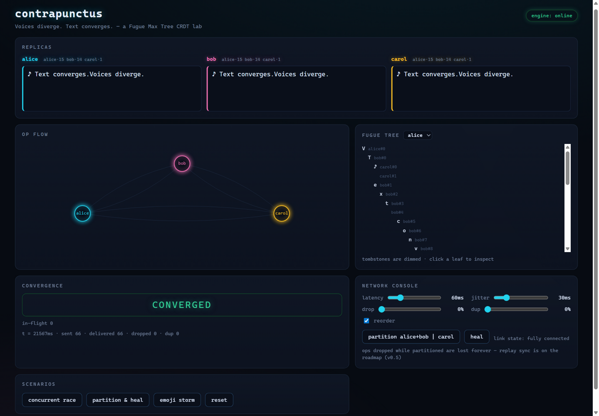
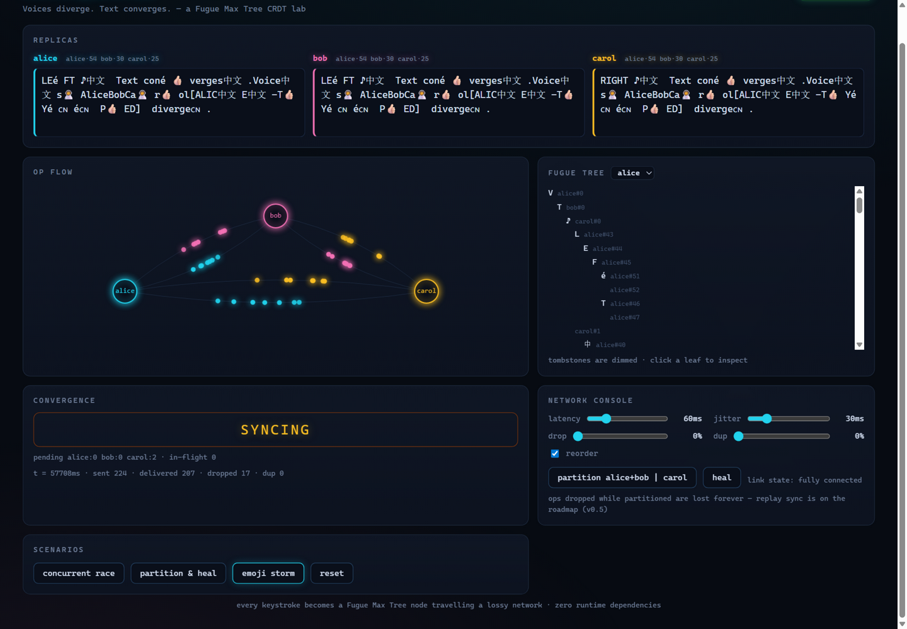

# contrapunctus

**Voices diverge. Text converges.**

A Fugue Max Tree CRDT collaborative-text engine with a deterministic chaos-network
simulator and an interactive browser lab — three replicas type concurrently, edits
travel a lossy / reordered / duplicated / partitionable network, and every replica
converges on the same text. **Zero runtime dependencies** (TypeScript, ESM).

[](https://github.com/qiyuhuating/contrapunctus/actions/workflows/ci.yml)
[](https://qiyuhuating.github.io/contrapunctus/)



## Why it exists

Concurrent typing is the hard part of collaborative editing: two people typing
different words at the same gap can produce interleaved garbage like `ABaAlibce`.
**Fugue** (Weidner & Kleppmann, *The Art of the Fugue*, arXiv:2305.00583) solves
this with a tree of list elements whose traversal *provably* never interleaves
concurrent insert runs. This repo implements the Max Tree variant faithfully and
points a chaos simulator at it:

- **Fugue Max Tree core** — each element is a node `(parent, side, causal dot)`;
  document order is the in-order walk; right-side siblings are ordered by reverse
  dot, which is what keeps concurrent runs contiguous.
- **Order-independent apply** — `applyRemote` converges under *any* delivery
  order; ops whose parent has not arrived yet are buffered and retried to fixpoint.
- **Chaos network** — virtual clock, seeded PRNG (mulberry32), latency/jitter/
  drop/dup/reorder knobs and one-click partitions. Same seed ⇒ identical schedule,
  so any failure is exactly reproducible.
- **Grapheme-safe** — edits are unit-per-grapheme (`Intl.Segmenter`): emoji
  ZWJ sequences, flags, combining accents and CJK survive concurrent edits.

## Try it

```bash
npm install
npm run demo      # → http://127.0.0.1:5179
```

Type into any pane, drag the network knobs, partition the cluster mid-keystroke,
then click the scenario buttons. What to look at:

- **op flow** — every deliver is a glowing dot on an arc; drops flash red.
- **fugue tree** — the actual algorithm, live: nodes with `(parent, side, dot)`,
  tombstones dimmed. Click a leaf to inspect it.
- **convergence** — honest meter: `SYNCING` while ops are in flight or buffered;
  after a partition it stays amber, because ops dropped on a downed link are gone
  forever (no anti-entropy in this layer — that is v0.5 on the roadmap).

Live version: **[qiyuhuating.github.io/contrapunctus](https://qiyuhuating.github.io/contrapunctus/)**



## Engineering

```bash
npm test        # 40 unit + property tests (out-of-order convergence, unicode, paper scenarios, mini-fuzz)
npm run fuzz    # 100-seed chaos fuzz + interleaving stress + determinism proofs (SEED=<n> reproduces one case)
npm run bench   # vitest benchmarks
npm run typecheck
```

Testing is property-based, because CRDT guarantees are properties: strong eventual
consistency, no loss, no duplication, no interleaving, grapheme integrity. Every
randomized test is seeded and prints its failing seed. Benchmarks (Node 24, this
repo's `vitest bench`):

| benchmark                                   | throughput            |
| ------------------------------------------- | --------------------- |
| local insert (single replica)                | ~18,700 ops/s         |
| remote apply into fresh replica              | ~19,500 ops/s         |
| 3-replica cluster, 100 concurrent edits + full settle | ~1.0 ms per scenario |

Coverage of the guarantees:

- **Convergence under any order** — ops replayed in ≥50 shuffled orders per
  scenario must all agree with the reference result.
- **No interleaving** — concurrent `AAAA`/`BBBB` races at 8 position shapes × 40
  merge orders must land contiguously (the FugueMax guarantee).
- **No loss / no duplication** — visible graphemes must equal the multiset of
  inserted-minus-deleted nodes across 100 chaos seeds.
- **Network determinism** — two simulations with one seed have byte-identical
  delivery schedules and stats.

## Layout

```
src/crdt/    Fugue Max Tree replica (types, tree, replica)
src/net/     SimNetwork (virtual clock, chaos) + Cluster (replica wiring)
demo/        the interactive lab (vanilla TS + canvas, no framework)
tests/       full fuzz suites            bench/  vitest benchmarks
```

Deep dive: [ARCHITECTURE.md](ARCHITECTURE.md) ·
[ROADMAP.md](ROADMAP.md) · [CONTRIBUTING.md](CONTRIBUTING.md) ·
internal contract: [DESIGN.md](DESIGN.md)

## Honest limits

CRDTs solve *merging*, not everything: messages dropped during a partition are
lost (no replay sync yet), concurrent-delete intent is a convention, cursors are
not yet anchored, and tombstones are kept forever. Each of these is a versioned
roadmap item with acceptance criteria, not a surprise.

## License

[MIT](LICENSE) © 2026 qiyuhuating
